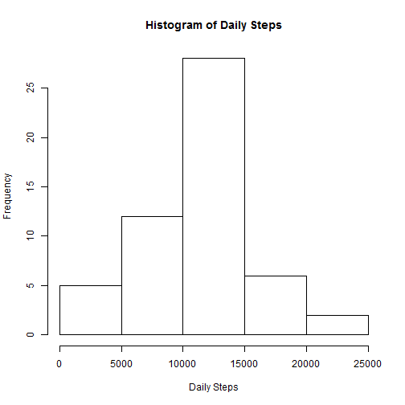
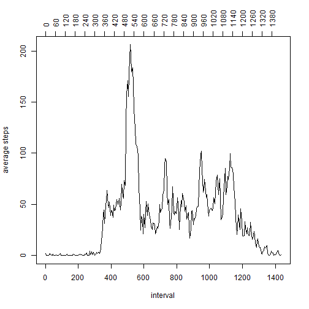
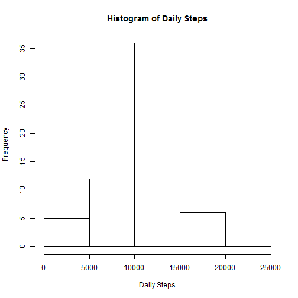
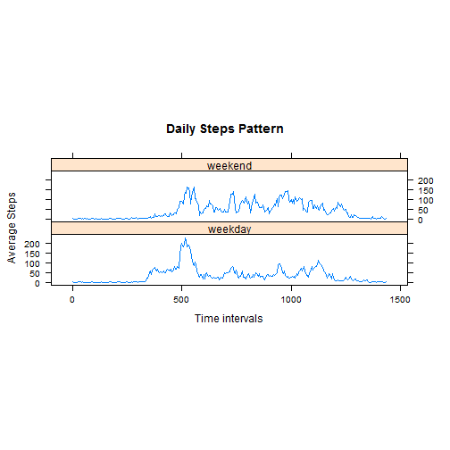

## Loading and preprocessing the data

I assume that the current directory should be where the data file is. If it's not, the following script will not work. 

## Read in the data


```r
unzip("./activity.zip")
activity_data_file_name <- "./activity.csv"
data <- read.csv(activity_data_file_name, stringsAsFactors=FALSE)
```

Here are the column names of the read data:


```r
names(data)
```

```
## [1] "steps"    "date"     "interval"
```

## What is mean total number of steps taken per day?


```r
library(dplyr)
daily <- data %>% group_by(date) %>% summarize(daily.steps = sum(steps))
```

The histogram of the total number of steps taken each day


```r
hist(daily$daily.steps, main = "Histogram of Daily Steps", xlab = "Daily Steps")
```

 

The mean and median of the total number of steps taken per day are as follow:


```r
summary(daily$daily.steps)
```

```
##    Min. 1st Qu.  Median    Mean 3rd Qu.    Max.    NA's 
##      41    8841   10760   10770   13290   21190       8
```

## What is the average daily activity pattern?


```r
daily_pattern <- data %>% group_by(interval) %>% summarize(average.steps = mean(steps, na.rm = TRUE))
plot(seq(0, 1435, by=5), daily_pattern$average.steps, xlab = "interval", ylab = "average steps", type = "l")
axis(3, at = seq(0, 1435, by = 60), las = 2)
```

 

As the interval value representing interval symbolically, not numberically, using interval to x-y plot would distord the time series pattern somehow. Thus use seq(0, 1435, by= 5) the numberic equivalent as x values.

The axis at the top shows more detailed of the number of minutes from 00:00 hour. 

The 5-minute interval, on average across all the days in the dataset, contains the maximum number of steps is 

```r
daily_pattern[which.max(daily_pattern$average.steps), "interval"]
```

```
## Source: local data frame [1 x 1]
## 
##   interval
## 1      835
```

This is interpreted as the interval starting at 08:35 in the morning. It matches with the daily pattern graph.

## Imputing missing values

The total number of missing values in the dataset (i.e. the total number of rows with NAs):


```r
nrow(data[!complete.cases(data),])
```

```
## [1] 2304
```

For now, use the strategy of the mean steps for an interval to fill the missing steps at the corresponding interval, since the steps pattern is highly related to the time of a day.

(As the study suggests that activity pattern is highly correlated to the time of a day, and the day of a week, for further study, it might be more accurate to use the mean steps of of intervals at weekends or weekdays to replace the corresponding NA's. I might revisit this after I have the basic assignment done.)

The following is the approach to replace the NA in steps:

Get the all indices with NA steps;
Find the corresponding intervals of those NA for steps
Find the mean steps for those interval corresponding to the NA steps, and assign the found mean steps for the interval to replace those NA for steps.

```r
na.steps.indices <- which(is.na(data$steps))
na.steps.interval <- data$interval[na.steps.indices]
data$steps[na.steps.indices] <- round(as.numeric(daily_pattern$average.steps[match(na.steps.interval, daily_pattern$interval)]))
```

With the steps NA replaced, compute again the daily summary. 

```r
daily_fixed <- data %>% group_by(date) %>% summarize(daily.steps = sum(steps))
```


The histogram after the replacing NA in steps:


```r
hist(daily_fixed$daily.steps, main = "Histogram of Daily Steps", xlab = "Daily Steps")
```

 

The mean and median of the total number of steps after replacing NA taken per day are as follow:


```r
summary(daily_fixed$daily.steps)
```

```
##    Min. 1st Qu.  Median    Mean 3rd Qu.    Max. 
##      41    9819   10760   10770   12810   21190
```

With the treatment of NA in steps, there is higher concentration in the frequency of the high steps from 10,000 to 15,000. 
There is no change to the mean, and median. But the 1st quantile moves higher, and 3rd quantile moves lower, that the range of the middle 50% of the distribution becomes narrower, which is consistent with the hitogram view.

## Are there differences in activity patterns between weekdays and weekends?

Create a new factor variable, weekends_or_not, in the dataset with two levels -- "weekday" and "weekend" indicating whether a given date is a weekday or weekend day.


```r
library(lubridate)
data_day_of_week <- data %>% 
  mutate(weekends_or_not = factor(wday(ymd(data$date), label=TRUE) %in% c("Sun", "Sat"), labels = c("weekday", "weekend"))) 
```

Split the data for weekdays, and weekends, to calculate the average steps per interval. 

(I wish to know if there is anyway not explicitly split the data, but calculate the respective average per interval for both weekdays and weekends. It would be more elegant, saving the eventual rbind for Lattice xyplot.)


```r
data_weekends <- filter(data_day_of_week, weekends_or_not == "weekend")
data_weekdays <- filter(data_day_of_week, weekends_or_not == "weekday")

daily_pattern_weekends <- data_weekends %>% group_by(interval) %>% summarise(average.steps = mean(steps))
daily_pattern_weekdays <- data_weekdays %>% group_by(interval) %>% summarise(average.steps = mean(steps))
```

Now draw the time series plots for both weekdays and weekends:

Prepare data: For the same reason above use seq(0, 1435, by=5) as the absolute time interval to better represent the x-values to avoid the skew at the hour crossing.

Combine the data in order to xyplot plot by weekends_or_not variable.


```r
daily_pattern_weekends <- mutate(daily_pattern_weekends, weekends_or_not = "weekend", absolute.interval = seq(0, 1435, by=5))
daily_pattern_weekdays <- mutate(daily_pattern_weekdays, weekends_or_not = "weekday", absolute.interval = seq(0, 1435, by=5))

daily_pattern_aggregated <- rbind(daily_pattern_weekends, daily_pattern_weekdays)
```

Actually draw the time series for both weekends and weekday. 


```r
require(lattice)
attach(daily_pattern_aggregated)
```

```
## The following objects are masked from daily_pattern_aggregated (pos = 4):
## 
##     absolute.interval, average.steps, interval, weekends_or_not
## 
## The following objects are masked from daily_pattern_aggregated (pos = 5):
## 
##     average.steps, interval, weekends_or_not
```

```r
xyplot(average.steps~absolute.interval|weekends_or_not, main = "Daily Steps Pattern", ylab = "Average Steps", xlab = "Time intervals", type = "l")
```

 

The difference of daily pattern may be better identified by the distributions of the average steps:

```r
summary(daily_pattern_weekends$average.steps)
```

```
##    Min. 1st Qu.  Median    Mean 3rd Qu.    Max. 
##   0.000   1.234  32.310  42.360  74.610 166.600
```

```r
summary(daily_pattern_weekdays$average.steps)
```

```
##    Min. 1st Qu.  Median    Mean 3rd Qu.    Max. 
##   0.000   2.289  25.810  35.610  50.810 230.400
```

So it seems that the weeends and weekdays' pattern are indeed different. The weekends'tends to be more evenly spread, and less extreme than that of the weekdays', and the higher level of steps start later, and edns also later, typical of weekends' leisure style! 

-----

Dear peer, 

Please have mercy on me. My R-skill is quite rusty, especially with Lattice. I guess that there might be more elogant way to prepare the data for Lattice. I'm still learning. I hope that I have conveyed enough the sprit of "reproducible research" with my effort. 

Thank you for your time reviewing. Please give me feedbcak!
